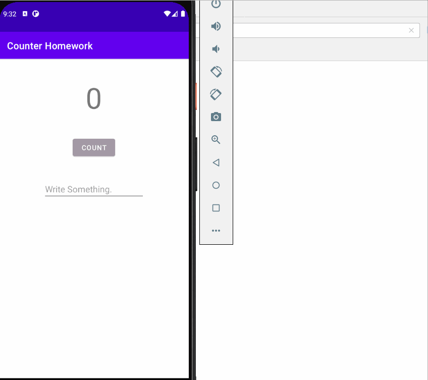

# Homework
 

## QUESTION 1
If you run the homework app before implementing onSaveInstanceState(), what happens if you rotate the device? Choose one:  
The EditText no longer contains the text you entered, but the counter is preserved.  
The counter is reset to 0, and the EditText no longer contains the text you entered.  
The counter is reset to 0, but the contents of the EditText is preserved.  
The counter and the contents of the EditText are preserved.  
<b>Ans: The counter is reset to 0, but the contents of the EditText is preserved.</b>
## QUESTION 2
What Activity lifecycle methods are called when a device-configuration change (such as rotation) occurs? Choose one:  
Android immediately shuts down your Activity by calling onStop(). Your code must restart the Activity.  
Android shuts down your Activity by calling onPause(), onStop(), and onDestroy(). Your code must restart the Activity.  
Android shuts down your Activity by calling onPause(), onStop(), and onDestroy(), and then starts it over again, calling onCreate(), onStart(), and onResume().  
Android immediately calls onResume().  
<b>Ans: Android shuts down your Activity by calling onPause(), onStop(), and onDestroy(), and then starts it over again, calling onCreate(), onStart(), and onResume().</b>
## QUESTION 3
When in the Activity lifecycle is onSaveInstanceState() called? Choose one:  
onSaveInstanceState() is called before the onStop() method.  
onSaveInstanceState() is called before the onResume() method.  
onSaveInstanceState() is called before the onCreate() method.  
onSaveInstanceState() is called before the onDestroy() method.  
<b>Ans: onSaveInstanceState() is called before the onStop() method.</b>
## QUESTION 4
Which Activity lifecycle methods are best to use for saving data before the Activity is finished or destroyed? Choose one:  
onPause() or onStop()  
onResume() or onCreate()  
onDestroy()  
onStart() or onRestart()  
<b>Ans: onPause() or onStop() </b>
